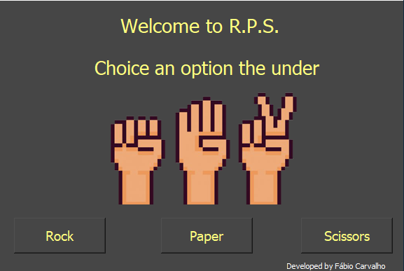
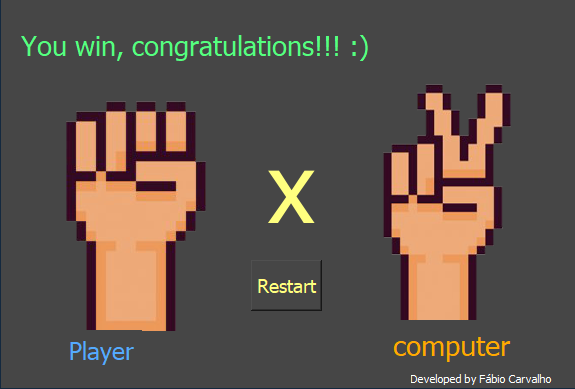

# Rock-Paper-Scissors
 

 

Game developed in python useing the library Qt Design.

#Start:

<h1>You need install the venv and pyqt5:</h1>
 

python -m venv .venv 

 

.venv\Scripts\activate

 

pip install pyqt5

